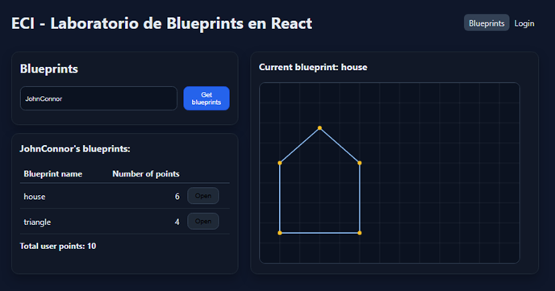
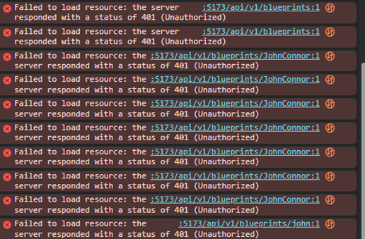
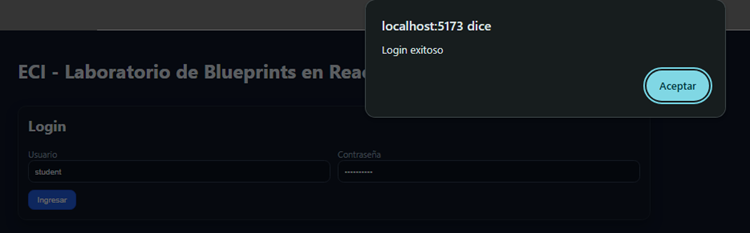
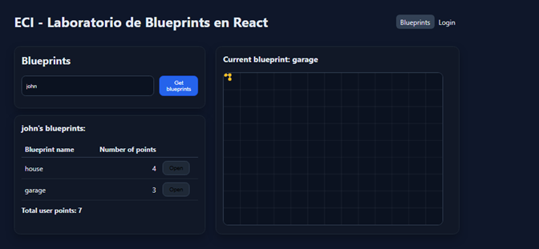

# Lab – React Client for Blueprints (Redux + Axios + JWT)

> Basado en el cliente HTML/JS del repo de referencia, este laboratorio moderniza el _frontend_ con **React + Vite**, **Redux Toolkit**, **Axios** (con interceptores y JWT), **React Router** y pruebas con **Vitest + Testing Library**.

## Objetivos de aprendizaje

- Diseñar una SPA en React aplicando **componetización** y **Redux (reducers/slices)**.
- Consumir APIs REST de Blueprints con **Axios** y manejar **estados de carga/errores**.
- Integrar **autenticación JWT** con interceptores y rutas protegidas.
- Aplicar buenas prácticas: estructura de carpetas, `.env`, linters, testing, CI.

## Requisitos previos

- Tener corriendo el backend de Blueprints de los **Labs 3 y 4** (APIs + seguridad).
- Node.js 18+ y npm.

Ver la especificación de glosario clave, consulta las [Definiciones del laboratorio](./DEFINICIONES.md).

## Endpoints esperados (ajústalos si tu backend quedo diferente)

- `GET /api/blueprints` → lista general o catálogo para derivar autores.
- `GET /api/blueprints/{author}`
- `GET /api/blueprints/{author}/{name}`
- `POST /api/blueprints` (requiere JWT)
- `POST /api/auth/login` → `{ token }`

Configura la URL base en `.env`.

## Cómo arrancar

```bash
npm install
cp .env.example .env
# edita .env con la URL del backend
npm run dev
```

Abre `http://localhost:5173`

## Variables de entorno

Crea un archivo `.env` en la raíz:

```variable
VITE_API_BASE_URL=http://localhost:8080/api
```

> **Tip:** en producción usa variables seguras o un _reverse proxy_.

## Estructura

```carpetas
blueprints-react-lab/
├─ src/
│  ├─ components/
│  ├─ features/blueprints/blueprintsSlice.js
│  ├─ pages/
│  ├─ services/apiClient.js   # axios + interceptores JWT
│  ├─ store/index.js          # Redux Toolkit
│  ├─ App.jsx, main.jsx, styles.css
├─ tests/
├─ .github/workflows/ci.yml
├─ index.html, package.json, vite.config.js, README.md
```

## 📌 Requerimientos del laboratorio

## 1. Canvas (lienzo)

- Agregar un lienzo (Canvas) a la página.
- Incluir un componente `BlueprintCanvas` con un identificador propio.
- Definir dimensiones adecuadas (ej. `520×360`) para que no ocupe toda la pantalla pero permita dibujar los planos.

## 2. Listar los planos de un autor

- Permitir ingresar el nombre de un autor y consultar sus planos desde el backend (o mock).
- Mostrar los resultados en una tabla con las siguientes columnas:
  - Nombre del plano
  - Número de puntos
  - Botón `Open` para abrirlo

## 3. Seleccionar un plano y graficarlo

Al hacer clic en el botón `Open`, debe:

- Actualizar un campo de texto con el nombre del plano actual.
- Obtener los puntos del plano correspondiente.
- Dibujar consecutivamente los segmentos de recta en el canvas y marcar cada punto.

## 4. Servicios: `apimock` y `apiclient`

- Implementar dos servicios con la misma interfaz:
  - `apimock`: retorna datos de prueba desde memoria.
  - `apiclient`: consume el API REST real con Axios.
- La interfaz de ambos debe incluir los métodos:
  - `getAll`
  - `getByAuthor`
  - `getByAuthorAndName`
  - `create`
- Habilitar el cambio entre `apimock` y `apiclient` con una sola línea de código:
  - Definir un módulo `blueprintsService.js` que importe uno u otro según una variable en `.env`.
  - Ejemplo en `.env` (Vite):

Se implementaron los 2 servicios con la misma interfaz uno que devolviera datos quemados en memoria "apimock" y otro que
consume el API REST real mediante axios "apiclient" y poder cambiar entre ellos solo modificando una linea en el .env
mientras que el mock llamaria funciones el cliente llamaria a los endpoints en el back

para realizar la conexion al backend se realizo ajustes debido a que no manejamos cors en el lab anterior
asi cambiamos que cambiamos la ruta del back de "vite" a "/api/v1", y luego agregamos una proxi ya que 
como el front corre en el puerto 5173 y el back "API" corre en el 8080 el navegador los trataria como origenes distintos
y bloquearia su cominicacion, el proxy resuelve este problema asi Vire re envia las rutas necesarias al back de 8080
sin embargo la URL se convierte en algo relativo y no en una direccion absoluta, hay que destacar que 
esto solo se realizo para efectos practicos del lab, en un despliege real se necesitaria el cors para poder funcionar.



Sin el backend desplegado y con el mock en True, podemos ver como en la busqeuda del autor JohnConnor lista sus planos 
desde el apimock y al abrir su plano de house se dibuja en el canvas.



Con el mock en false y sin haber iniciado sesion podemos ver , como las peticiones que salen
hacia el front y el proxi se las lleva al back fallan con un 401 porque el enpoint
esta protegido



Usando el usuario quemado del back del lab pasado "student" con su contraseña "student123" se realiza el respectivo
llamado y podemos ver como sale un aviso de loggin exitoso y el access_token se guarda
en la memoria local, asi se agrega en cada peticion.



Ya con la autentificacion podemos consultar los planos de los autores que se alojen en la base de datos del lab anterior
en este caso el autor jhon con los planos de house y garage, al darle open podemos ver como se abre
en este caso se ve pequeño y en una esquina ya que los planos originas eran cordenadas que iban de
0 a 15 y el canvas ahora mide 520x360.

```env
VITE_USE_MOCK=true
```

- `VITE_USE_MOCK=true` usa el mock.
- `VITE_USE_MOCK=false` usa el API real.

## 5. Interfaz con React

- El nombre del plano actual debe mostrarse en el DOM como parte del estado global (Redux).
- Evitar manipular directamente el DOM; usar componentes y props/estado.

## 6. Estilos

- Agregar estilos para mejorar la presentación.
- Se puede usar Bootstrap u otro framework CSS.
- Ajustar la tabla, botones y tarjetas para acercarse al mock de referencia.

Decidimos cambiar los colores de la app para que se sienta algo mas propio de la ECI
sin modificar realmente la logica, para que tuviera mas personalidad,
tambien cambiamos los texto de inglesa a español


Aqui podemos obsevar como se ve la nueva paleta de colores de la pagina ademas de
centrarla


Al pasar el mouse por una fila esta se resalta con un tono un poco mas claro para que se diferencie que esta
seleccionado


Aqui reducimos el tamaño de la ventana para ver como se com dimensiones distintas
podemos observar como se ajusta a la resolucion, ademas de ver el aviso resaltado de que
el "autor" "nadie" no existe.


## 7. Pruebas unitarias

- Agregar pruebas con Vitest + Testing Library para validar:
  - Render del canvas.
  - Envío de formularios.
  - Interacciones básicas con Redux (por ejemplo: dispatch de `fetchByAuthor`).

---

### Notas rápidas y recomendaciones

- Para el canvas en tests con jsdom: agregar un mock de `HTMLCanvasElement.prototype.getContext` en `tests/setup.js`.
- Para usar `@testing-library/jest-dom` con Vitest: en `tests/setup.js` importar `import '@testing-library/jest-dom'` y asegurarse de que Vitest provea el global `expect` (configurar `vitest.config.js` con la opción `test: { globals: true, setupFiles: './tests/setup.js' }`).
- Para la conmutación de servicios en Vite, usar `import.meta.env.VITE_USE_MOCK` para leer la variable en tiempo de ejecución.

## 📌 Recomendaciones y actividades sugeridas para el exito del laboratorio

1. **Redux avanzado**
   - [ ] Agrega estados `loading/error` por _thunk_ y muéstralos en la UI.
   - [ ] Implementa _memo selectors_ para derivar el top-5 de blueprints por cantidad de puntos.
2. **Rutas protegidas**
   - [ ] Crea un componente `<PrivateRoute>` y protege la creación/edición.
3. **CRUD completo**
   - [ ] Implementa `PUT /api/blueprints/{author}/{name}` y `DELETE ...` en el slice y en la UI.
   - [ ] Optimistic updates (revertir si falla).
4. **Dibujo interactivo**
   - [ ] Reemplaza el `svg` por un lienzo donde el usuario haga _click_ para agregar puntos.
   - [ ] Botón “Guardar” que envíe el blueprint.
5. **Errores y _Retry_**
   - [ ] Si `GET` falla, muestra un banner y un botón **Reintentar** que dispare el thunk.
6. **Testing**
   - [ ] Pruebas de `blueprintsSlice` (reducers puros).
   - [ ] Pruebas de componentes con Testing Library (render, interacción).
7. **CI/Lint/Format**
   - [ ] Activa **GitHub Actions** (workflow incluido) → lint + test + build.
8. **Docker (opcional)**
   - [ ] Crea `Dockerfile` (+ `compose`) para front + backend.

## Criterios de evaluación

- Funcionalidad y cobertura de casos (30%)
- Calidad de código y arquitectura (Redux, componentes, servicios) (25%)
- Manejo de estado, errores, UX (15%)
- Pruebas automatizadas (15%)
- Seguridad (JWT/Interceptores/Rutas protegidas) (10%)
- CI/Lint/Format (5%)

## Scripts

- `npm run dev` – servidor de desarrollo Vite
- `npm run build` – build de producción
- `npm run preview` – previsualizar build
- `npm run lint` – ESLint
- `npm run format` – Prettier
- `npm test` – Vitest

---

### Extensiones propuestas del reto

- **Redux Toolkit Query** para _caching_ de requests.
- **MSW** para _mocks_ sin backend.
- **Dark mode** y diseño responsive.

> Este proyecto es un punto de partida para que tus estudiantes evolucionen el cliente clásico de Blueprints a una SPA moderna con prácticas de la industria.
